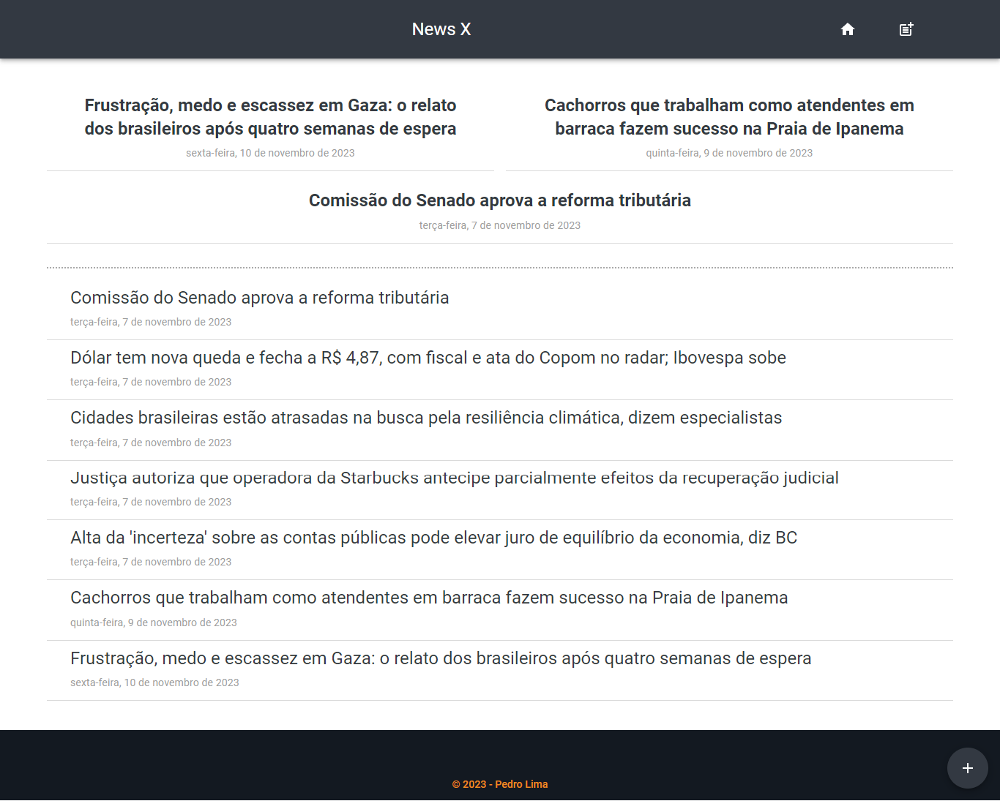
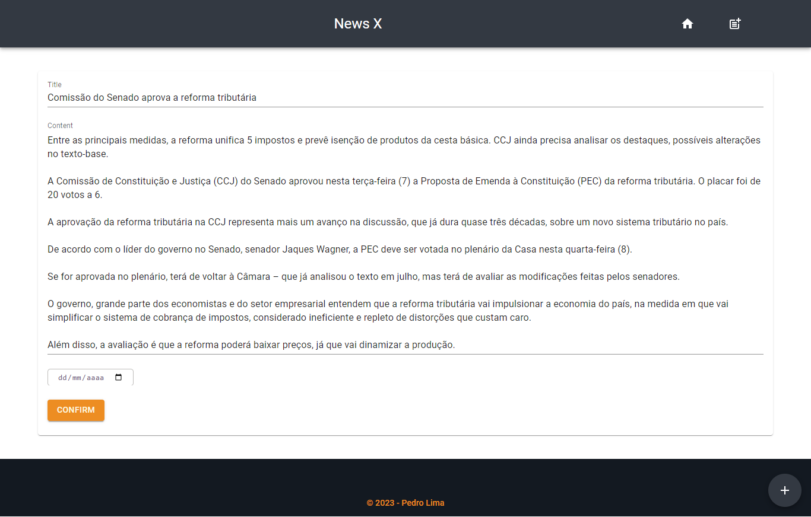
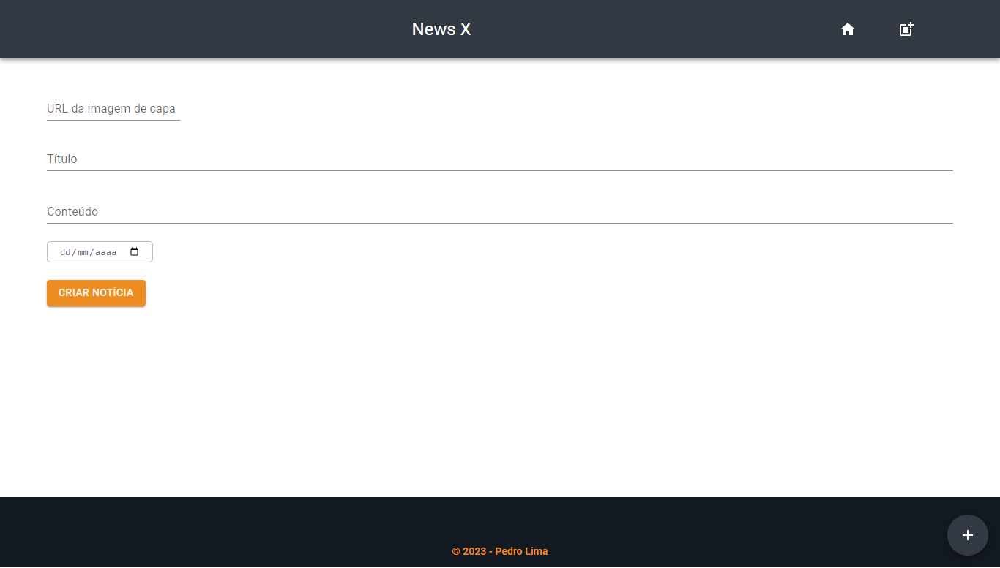

# News X

Uma página de notícias, com operações CRUD, vinculada ao banco de dados (MySQL), que permite ao usuário visualizar, adicionar, atualizar e deletar notícias.

O projeto é de minha autoria e foi inspirado em outras aplicações existentes, adaptando seus designs e recursos. A aplicação foi construída utilizando as tecnologias front-end: TypeScript, React, Material-UI (MUI) e Styled Components, ferramentas back-end: Node e MySQL.

## Screenshots






</br>

## 🎯 Objetivos

Os usuários podem:
> - Visualizar as ultimas notícias no top 3 e todas na linha editorial
> - Adicionar, atualizar e deletar notícias

O objetivo deste projeto foi desenvolver uma aplicação CRUD utilizando a linguagem Node.js com banco de dados relacional MySQL.

</br>

## 🔧 Propriedades e Tecnologias

> - Vite
> - TypeScript
> - React 
> - Material-UI (MUI)
> - Styled Components
> - Node
> - Express
> - MySQL Workbench
> - Postman
> - XAMPP

</br>

## 🧠 Meu aprendizado

O principal desafio desse projeto certamente foi criar e configurar um servidor. Minha base de estudos é pautada por JavaScript. Nada como buscar ter meu primeiro contato com o back-end usando uma linguagem familiar, dessa forma, o Node me ajudou bastante, já que essa linguagem é essencialmente o JavaScript do lado do servidor.

```js
const express = require("express")
const newsRouter = require("./routes/news")
const topNewsRouter = require("./routes/top-news")
const app = express()

const PORT = process.env.PORT || 4001

app.use("/news", newsRouter)
app.use("/top-news", topNewsRouter)

app.listen(PORT, () => {
    console.log("Server running in port: " + PORT)
})
```

Com o auxílio do Express, podemos criar e configurar nosso servidor de maneira fácil. Primeiramente, é necessário instanciar o módulo Express, criar uma porta e executar o servidor usando a função 'listen()'.

```js
const mysql = require("mysql")

const db = mysql.createConnection({
    host: "localhost",
    user: "root",
    password: "",
    database: "news"
})

module.exports = { db }
```

O próximo passo é vincular o banco de dados. Neste projeto, optei por utilizar o MySQL como banco de dados. Acima, vemos como conectar o banco de dados com o servidor.

```js
const express = require("express")
const newsRouter = express.Router()
const { db } = require("../db")

newsRouter.get("/", (req, res) => {
    const q = "SELECT * FROM news ORDER BY date ASC"
    
    db.query(q, (err, data) => {
        if (err) res.json(err)

        res.status(200).json(data)
    })
})
```

Por fim, é necessário criar as rotas para acessar os dados do banco. Na seção anterior, mostramos como criar uma rota GET. As instruções SQL são empregadas na função para definir a resposta a ser enviada, basta utilizar a função .query() na instância do banco de dados.

Como desafio secundário, enfrentei a elaboração do banco de dados em MySQL, onde foram implementadas as instruções do CRUD.

</br>

## 💻 Rodando o projeto


Para conferir a versão final é só realizar os seguintes passos:

### 1 - Clonando o Projeto:
Abra o terminal com o GitBash.
Navegue até o diretório onde deseja clonar o projeto.
Execute o comando:

```bash
git clone URL_DO_REPOSITORIO
```
Substitua URL_DO_REPOSITORIO pela URL do repositório Git do seu projeto.

### 2 - Instalando Dependências:
Backend (Node.js):

Navegue até o diretório do backend (localizado na pasta "api").

Execute o comando:

```bash
npm install
```
ou
```bash
yarn install
```

Frontend (React):

Navegue até o diretório do frontend (localizado na pasta "newsx").

Execute o comando:

```bash
npm install
```
ou
```bash
yarn install
```

### 3 - Executando o Projeto:
Backend (Node.js):
Navegue até o diretório do backend.

Execute o comando:

```bash
nodemon
```
Isso iniciará o servidor Node.js.

Frontend (React):
Navegue até o diretório do frontend.

Execute o comando:

```bash
npm run dev
```
Isso iniciará o servidor de desenvolvimento React.

</br>

## Autor

- LinkedIn - [Pedro A. Lima](https://www.linkedin.com/in/pedroalima6/)